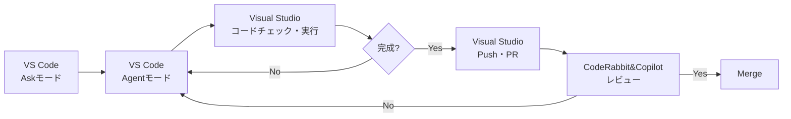

# Visual StudioとVS CodeとA(I)❤️

## 松井 敏

---

# 自己紹介

- 👨 松井 敏(まつい びん)
- 👨‍💻 フリーランスプログラマ
- 👜 某大学でSRE50% + [HACARUS](https://hacarus.com/ja/)でC#エンジニア30% + [ZenTech](https://www.zen-tech.co.jp/company)でAIエージェントエンジニア30%
- 🏆 [Microsoft MVP for Developer Technologies 2012-2025](https://mvp.microsoft.com/en-US/MVP/profile/f8610ff3-3c9a-e411-93f2-9cb65495d3c4)
- 📚 [Unity5 3Dゲーム開発講座 ユニティちゃんで作る本格アクションゲーム](https://amzn.to/47YnopE)
- 💻 [C#読書会主催](https://cs-reading.connpass.com/)、[Greek Alphabet Software Academy TA](https://greek-academy.org/)
- ❤️ プログラム、マンガ、料理、睡眠、妻&子供

---

# 本日のアジェンダ

- **Phase 1: AI Ask → AI Agent**
   - Delelop Tool : Visual Studio
- **Phase 2: AI Agent → AI Ask + AI Agent**
   - Delelop Tool : Visual Studio + VS Code
- **Phase 3: AI Ask + AI Agent → AI Plan + Parallel AI Agent**
   - Delelop Tool : Visual Studio + VS Code + Cursor

---
layout: center
class: text-center
---

AI Ask → AI Agent

Visual Studio

---

# I(私)のVisual Studioへの❤️(Ai)

- 大体2006年頃から使用開始。約20年共に歩んできたパートナー
- 僕にとって揺るぎないNo.1の神IDE
- 「死んだら棺に入れて」と思っている。まさに永遠の愛

---

# IとAI

## 2024年

- 仕事を辞めた9月頃はまだAIは名前付けの補助になる程度だった
- プロンプトを工夫して電卓を作らせてもまだまだ全然だった

## 2025年初頭

- AIが生成するコードの質が徐々に向上
- 個人開発でAIとペアプログラミングを開始
- **Askモード**で出力されたコードをペーストする機会が増加

---

# AI Agent

## Agentモードの波

- 世の中で**Agentモード**が徐々に話題になってきていた
- しかしVisual Studioにはなかなか実装されない
- VS Codeは既に搭載済みだった

## 2025年5月
- 2〜3日程度のタスクをAIと取り組むことに
- Askモードで出力されたコードで3回連続失敗が続く
- フラストレーションがたまってきた
- そこでVS Code の Agentモードを試すことに

---

# VS Codeへの浮気

- ちなみに自分にとってVS Codeを使う事かなり大きな決断
- そもそもプログラムに他の開発環境を使う事にはかなりの抵抗があった（ある意味では浮気）
- それまでVS Codeを軽くさわることはあったが、単なるテキストエディタだと思っていた
- IDEとテキストエディタはツールとしても体験としても全く次元が異なるものという認識

---

# I は Shock

- いきなりタスクの全コードを数分で出力
- それがほぼ想定通りだった
- 凄いというよりも強い憤りを感じた

「ここまでやられたら、ちっとも面白くない」

「むしろコードを書く楽しみを奪われる」

---

# Visual Studio’s Agent

- しかし徐々にAI開発はVS CodeのAgentモードにスライドしていく
- そして待望のVisual Studioにも Agentモードが実装される！
- しかし、期待外れの出来栄え...大きく落胆。冷める愛。

---
layout: center
class: text-center
---

AI Agent → AI Ask + AI Agent

Visual Studio + VS Code

---

# Visual Studio + VS Code

## Visual Studio と VS Codeの二刀流

### VS Code + GitHub Copilot
- **Askモード**で仕様を固める
- **Agentモード**で実装まで任せる
- **Agentモード**でコード修正を繰り返す

### Visual Studio
- コードチェック
- 実行と確認
- コミット・PR作成

---

# I ❤️ AI Model

## Anthropic is No.1

- 初期のAIコーディングはGPTを使用していた
- Github Copilotでモデルが選べるようになり**Claude Sonnet 3.5**がかなり良かった
- その後様々なモデルを試すも、個人的にはずっとAnthropicが最強
- CopilotライセンスでCodexが使えるようになり試したが、個人的にはやっぱりAnthropic

## Claude Code

- 使ってみたが日本語入力時の場所移動が嫌すぎる
- VS Codeの公式ExtensionでGUI対応
- 徐々にGitHub CopilotとClaude Codeの二刀流に

---

# Claude Code vs GitHub Copilot
- どちらもClaude Sonnet 4.5ベースなので挙動は概ね近い
- プロンプトを繰り返すと差はほぼ感じない
- ただClaude Codeの方が**初手のプロンプトの精度が顕著に高い**
- Claude Code Proだったが、10回ほどでリミットが来たので遂にMaxに課金
- その後ぐらいからVS CodeのClaude Code Extensionはずっと調子悪いw
- PCのメモリを32MB→64MBで、ビックリするぐらい安定ww

---

# 初手のプロンプト

- AI開発で最初の１回はとても重要
- Askモードで練り上げたプロンプトをAgentモードに投げるのが王道
- 精度をさらに上げるにはClaude.mdやcopilot-instructions.mdの整備が重要
- MCPも初回が一番コンテキストを把握してくれている印象
- プロンプトを繰り返すほどコンテキストが薄れて忘れ去られる
- Askモードからさらに特化型のPlanモードが搭載

---

# Spec-Driven Development

- 仕様（spec）をAIと共に作成し、それを唯一の基準としてコードを生成し検証していく開発スタイル
- AIに初回でやってもらうにはSpecDDが相性が良い
- まださわってないけれどKiroは仕様を構造化するのが基本スタイル
- GitHubもSpec Kitを作っている
- 日本発のcc-sddがよさげ

---
layout: center
class: text-center
---

AI Ask + AI Agent → AI Plan + Parallel AI Agent

Visual Studio + VS Code + Cursor

---

# AI並列開発

## 2025年11月

- Agent中は別の事した方が効率的ではある。が、自分はマルチタスクがとても苦手
- 仕事中に、ふと並列で出来たら効率的だなと思った
- ちょうどCursor2.0で並列開発の機能が乗った
- ある勉強会でAnthropicの基調講演でも並列開発の話になった
- git worktree + tmuxがよさげ

---

# git worktree

- 並列開発ではブランチを切っても衝突するので複数リポジトリが理想
- 実際過去複数リポジトリをクローンして切り替えていたこともある
- ただ数分だけSSDも圧迫するし、管理も間違えやすい
- もっといい機能がgitにあるんじゃない？→それがgit worktree。
- 好きな別フォルダに全コピーされ、.gitは元と共有。
- commit, pushも可能。git worktree removeで削除

---

# 実験その１　VS Codeでマルチモデル

- Codex, Claude Code, GitHub Copilotに全く同じ作業を振ってみた
- フォルダだけ作ってその下に作ってもらうように指示
- 3つのチャットを順番に読んでいくだけでも結構脳の負荷が高く疲れた。。

---

# 実験その2　Cursor並列開発マルチモデル

- CursorでClaude Code, GPT5-codexで並列開発
- Claude Code×4は正直殆ど変わらないのであんまり。
- worktreeは自動で作ってくれる
- なるべく1手で完了までいって実行してもらうのが理想。これもプロンプト次第
- Cursorでは差分が見にくいし各worktreeの比較が難しい。
- 現状はVisual Studioで一つずつ確認している
- UI未確定時とかで色んなパターンを見たい時には結構良い

---

# 実験その3　オリジナル並列開発マルチモデル

- Cursorで今からやることをやろうとしたら上限来てたｗ。。。
- 先ずはClaude CodeのPlanモードで内容を詰める。詰まった内容はmdで出力する。
- VS CodeでCodex->GPT-5.1-Codex-Max, Claude Code->Sonnet 4.5(Opusにすれば良かった), GitHub Copilot->Gemini3.0で並列開発
- それぞれにworktreeを作ってと頼んで実行までやってくれと頼む
- 因みにGemini3.0はいきなり無視してworktreeを作らなかったｗ。
- 個人的な見解ではClaude Codeの勝利
- マージが上手くいかず結局手でコピーした。。

---

# 並列開発の可能性

- 並列開発は特定のフェーズで沢山、色んなパターンで確認したい場合は特に使いやすい
- 現状は4-8個程度だが、並列数はもっとあげられるはず。そうなると突然変異も生まれるらしい
- さらに充実していけば大量のサムネイルから一目見て選ぶABテスト的な1-100テストも可能
- 並列にはキャラ付けや役割付けなども出来る。そのうちレビューもAIがやり出す
- その中で100並列、1000並列とさらに増えていけば人間は太刀打ちできない

---

# 面白そうな技術

- GitHub Copilot Coding Agent  
  - 個人的にはAgentモードよりもさらに好きじゃない。やることがレビューだけになる
  - ただいくらでも並列に出来る。自分が仕事していない時間に働いてもらえる
- LLM-as-a-Judge
  - LLMをLLMで評価する仕組み　　
  - 結局AIの良し悪しは個人の好みになりがちなので、評価もAIに判断してもらう
  - 並列開発でやりたいことは結局結果の確認
- KAMUI
  - Multi-Agent AI OS
  - 既に100並列も検討中
  - 今後は1000並列の使い方も議論中

---

# まとめ：AI開発スタイルの進化

### Phase 0
**今までの開発**
- 2006-2024
- Visual Studio
- Iは一人。IDE最強。

### Phase 1
**AIサポート開発**
- 2025年2月
- Visual Studio+Askモード
- AIは質問相手

### Phase 2
**AIペアプロ開発**
- 2025年6月
- Visual Studio+VS Code+Agentモード
- AIはペアプロ相手

### Phase 3
**AI並列開発**

- 2025年11月
- Visual Studio+VS Code+Cursor+並列Agent
- AIは複数の部下

---

# 最重要補足

- 今までのVisual StudioのAgentモード
- 数カ月に１回程度試してほんのマシになってもずっとイマイチ
- Claude Code > VS Code >>>>>>>>>>>>>>>> Visual Studio（論外）

---

# Visual Studio 2026’s Agent ❤️

- 先週Visual Studio2026でのAgentモード再検証
- Claude Code > VS Code > Visual Studio
- 劣る部分もあるが正直使うに値するレベル！！
- コード、差分、ビルドなどやっぱりIDEの方が優れていると思う点もある
- 帰ってきた我が愛人

