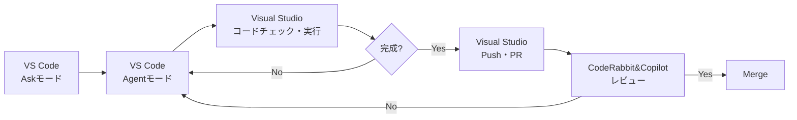

# Visual StudioとVS CodeとA(I)

## 松井 敏

---

# 自己紹介

- 👨 松井 敏(まつい びん)
- 👨‍💻 フリーランスプログラマ
- 👜 某大学でSRE50% + HACARUSでC#エンジニア30% + ZenTechでAIエージェント30%
- 🏆 Microsoft MVP for Developer Technologies 2012-2025
- 📚 Unity5 3Dゲーム開発講座 ユニティちゃんで作る本格アクションゲーム
- 💻 C#読書会主催、Greek Alphabet Software Academy TA
- ❤️ プログラム、マンガ、料理、睡眠、妻&子供

---

# 本日のアジェンダ

1. **AI開発**
   - Visual Studio × AI

2. **二刀流開発**
   - (Visual Studio + VS Code) × AI

3. **並列開発**
   - VS Code(GitHub Copilot, Codex, Claude Code) × AI
   - Cursor(Claude Code x 4, GPT5.1 Codex Hight x 4)  × AI

---
layout: center
class: text-center
---

AI開発

Visual Studio × AI

---

# I(私)のVisual StudioへのAi(愛)

- 大体2006年頃から使用開始
- つまり約20年共に歩んできたパートナー
- 僕にとって揺るぎないNo.1の神IDE
- 「死んだら棺に入れて」と思っている。まさに永遠の愛

---

# IとAI

## 2024年

- 9月頃までは生成AIが名前付けの補助になる程度
- プロンプトを工夫してアプリを作らせても正直まだまだ

## 2025年初頭

- AIが生成するコードの質が徐々に向上
- 個人開発でAIとペアプログラミングを開始
- **Askモード**で出力されたコードをペーストする機会が増加

---

# AI Agent

## Agentモードの波

- 世の中で**Agentモード**が徐々に話題になってきた
- しかしVisual Studioにはなかなか実装されない
- VS Codeは既に搭載済みだった

## 2025年5月
- 2〜3日程度のタスクをAIと取り組むことに
- Askモードで出力されたコードでは何度か失敗が続く
- フラストレーションがたまってきた
- そこでVS Code の GitHub CopilotのAgentモードを試すことに

---

# その時の内心

- ちなみに自分にとってはとても大きな決断
- 他の開発環境を使う事にはかなりの抵抗があった
- それまでVS Codeを軽くさわることはあったが、単なるテキストエディタだと思っていた
- IDEとテキストエディタはツールとしても体験としても全く次元が異なるものという認識
- ある意味では宗教を変えるぐらいの一大決心

---

# AI Shock

- いきなりタスクの全コードを数分で出力
- それがほぼ想定通りだった
  - （今思えばたまたま？）
- 凄いというよりも強い憤りを感じた

「ここまでやられたら、ちっとも面白くない」

「むしろコードを書く楽しみを奪われる」

---

# Visual Studio’s Agent

- しかし徐々にAI開発はVS Code + Github CopilotのAgentモードにスライドしていく
- そして待望のVisual Studioにも Agentモードが実装される！
- しかし、期待外れの出来栄え...
- 大きく落胆

---
layout: center
class: text-center
---

二刀流開発スタイル

(Visual Studio + VS Code) × AI

---

# 二刀流

## Visual Studio と VS CodeのW開発

### VS Code + GitHub Copilot
- **Askモード**で仕様を固める
- **Agentモード**で実装まで任せる
- **Agentモード**でコード修正を繰り返す

### Visual Studio
- コードチェック
- 実行と確認
- コミット・PR作成

---

# AI Model

## Anthropic is No.1

- 初期のAgenticコーディングはGPTを使用
- Github Copilotで選べるようになった**Claude Sonnet 3.5**がかなり良かった
- その後様々なモデルを試すも、個人的にはずっとClaude Sonnetが最強
- Visual Studio Code InsidersでCodexも試したが、個人的にはやっぱりClaude Sonnet

## Claude Code

- 使ってみたが日本語入力時の場所移動が嫌すぎる
- Visual Studio Codeの公式ExtensionでGUI対応
- 徐々にGitHub CopilotとClaude Codeの二刀流に

---

# Claude Code vs GitHub Copilot
- どちらもClaude Sonnet 4.5ベースなので挙動は概ね近い
- プロンプトを繰り返すと差はほぼ感じない
- ただClaude Codeの方が**ファーストプロンプトの精度が顕著に高い**
- Claude Code Proだったが、10回ほどでリミットが来るためMaxに課金した

---

# ファーストプロンプト

- AI開発で最初の１回はとても重要
- Planモードで練り上げたプロンプトをAgentモードに投げるのが王道
- 精度をさらに上げるにはClaude.mdやcopilot-instructions.mdの整備が重要
- MCPも初回が一番コンテキストを把握してくれている印象
- プロンプトを繰り返すほどコンテキストが薄れて忘れ去られる

---

# Spec-Driven Development

- AIに初回でやってもらうにはSpecDDが相性が良い
- まださわってないけれどKiroの基本コンセプト
- GitHubもSpec Kitを作っている
- 日本発のcc-sddがよさげ

---
layout: center
class: text-center
---

並列開発

VS Code(GitHub Copilot, Codex, Claude Code) × AI

Cursor(Claude Code x 4, GPT5.1 Codex Hight x 4)  × AI

---

# 並列開発

## 2025年11月

- Agent中は別の事した方が効率的ではある。が、自分はマルチタスクがとても苦手
- 仕事中に、ふと並列で出来たら効率的だなと思った瞬間があった
- ちょうどCursor2.0で並列開発の機能が乗った
- ある勉強会でAnthropic社員の基調講演でも並列開発の話になった
- git worktree + tmuxがよさげ

---

# git worktree

- 並列開発するのであればブランチでは衝突するので複数リポジトリが想定される
- 実際過去よく複数リポジトリ作って切り替えていたこともある
- ただ数分だけSSDも圧迫するし、管理も間違えやすい
- もっといい機能がgitにあるんじゃない？→それがgit worktree。
- 好きな別フォルダに全コピーされ、.gitは元と共有。
- 元のブランチにcommitも可能。git worktree removeで削除

---

# 実験その１　Visual Studio Code Insiders

- Codex, Claude Code, GitHub Copilotに全く同じ作業を振ってみた
- フォルダだけ作ってその下に作ってもらうように指示
- 3つのチャットを読んでいくだけでも結構脳の負荷が高い

---

# 実験その2　Cursor並列開発マルチモデル

- CursorでClaude Code, GPT5-codex, Composeで並列開発
- Claude Code×4は正直殆ど変わらないのであんまり。
- 各worktreeの比較が難しい
- 現状はVisual Studioで一つずつ確認
- なるべく実行出来る所まで作ってもらって結果だけ見るのが良い
- UI未確定時とかにたまに使っている

---

# 並列の可能性

- 並列開発は特定のフェーズで沢山、色んなパターンで確認したい場合は特に使いやすい
- 現状は4個程度だが、並列数はもっとあげられるはず。そうなると突然変異も生まれるらしい
- 各worktreeが必ず実行まで行ってくれるようになるれば確認だけで良くなる
- さらに充実していけば大量のサムネイルから一目見て選ぶABテスト的な1-100テストも可能
- 並列にはキャラ付けや役割付けなども出来る。そのうちレビューやジャッジもAIがやり出すとか
- その中で1000並列、10000並列と増えていけば人間は太刀打ちできない

---

# 面白そうな技術

- GitHub Copilot Coding Agent  
  - 個人的にはAgentモードよりもさらに好きじゃない
  - やることがレビューだけになる
  - ただいくらでも並列に出来る
- LLM-as-a-Judge
  - LLMをLLMで評価する仕組み　　
  - 結局良し悪しは個人の好みになりがちなのでAIに判断してもらう
  - 並列開発でやりたいことは結局結果の確認
- KAMUI
  - Multi-Agent AI OS
  - 既に100並列も検討中
  - 今後は1000並列の使い方も議論中

---

# まとめ：開発スタイルの進化

## 3つのフェーズ

### Phase 1
**Visual Studio一筋**
- 2006-2024
- IDEこそ正義

### Phase 2
**Visual Studio+VS CodeのW体制**
- 2025年5月
- VS Code Agent + Visual Studio
- AIとのペアプロ

### Phase 3
**並列開発**

- 2025年11月
- VS Code(GitHub Copilot, Claude Code),
- VsCode Insider(GitHub Copilot, Codex, Claude Code), 
- Cursor(Claude Code, GPT5.1 Codex Hight)
- まだスタイルは模索中

---

# 最重要補足

- 今までのVisual StudioのAgentモード
- 数カ月に１回程度試してほんのマシになってもずっとイマイチ
- Claude Code > VS Code >>>>>>>>>>>>>>>> Visual Studio（論外）

---

# Visual Studio 2026’s Agent ♡

- 先週Visual Studio2026でのAgentモード再検証
- Claude Code > VS Code > Visual Studio
- コード、差分、ビルドなどやっぱりIDEの方が優れていると思う点もある
- 帰ってきた我が愛人

