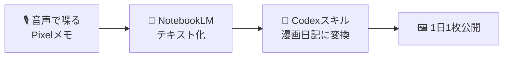

# 仕事のログを取り始めたらいつの間にかマンガを描き始めていた

## みやこでIT 特別編

### 松井 敏

---

# 自己紹介

- 👨 [松井 敏(まつい びん)](https://binnmti.github.io/resume/)
- 👨‍💻 [大阪大学 量子情報・量子生命研究センター(QIQB) 特任研究員](https://qiqb.osaka-u.ac.jp/members)
  - 🤖 フリーランスプログラマ(SRE,Windowsプログラマ, AIAgentプログラマ)
  - 🌴 キャリアブレイク(9カ月間の休暇)
  - 🖥️ Codeer(Windowsプログラマ : キーエンス出向)
  - 🎮 コナミ(ゲームプログラマ : パワプロ、プロスピ)
- 📚 [Unity5 3Dゲーム開発講座 ユニティちゃんで作る本格アクションゲーム](https://amzn.to/47YnopE)
- 💻 [C#読書会主催](https://cs-reading.connpass.com/)、[Greek Alphabet Software Academy TA](https://greek-academy.org/)
- 🏆 [Microsoft MVP for Developer Technologies 2012-2025](https://mvp.microsoft.com/en-US/MVP/profile/f8610ff3-3c9a-e411-93f2-9cb65495d3c4)
- ❤️ プログラム、マンガ、料理、睡眠、妻&子供

---

# 仕事のログを取り始めたきっかけ
- 先月転職した
- たまたまYoutubeで日々の活動を**音声ログ**を残すと良いというのを見た
- 軽い気持ちで真似してみた
- 🎙️ **10分前後**、今日あったことをひたすら喋るだけ

---

# まずは「喋って残す」習慣

- いろいろ試して、**Pixelのレコーダー機能**（音声入力）に落ち着いた
- ノイズキャンセリングイヤホンよりスマホの方が認識が良かった
- ３日坊主で辞めない方が良い。話し続けるのに慣れるのに少しかかる。

---
# 保存

- レコーダーを開くと**NotebookLM** に投げる仕組みがあるので毎日共有した
- 名前が自動でつかないので、どれがいつのファイルか分かりづらくなる。
- 毎日リネームしているが習慣づかないと面倒
- 音声で最初に今日の日付を言うようにした

---

# 1ヶ月続けた

- 1ヶ月分のログがたまった
- それを元に **まとめブログ** を書いてみたら、まあまあいい感じに使えた
- ただ、文章になっていても細かく見直す気にはならなかった。
- いざとなったらNotebookLMに聞けば良いのは強み

---

# 偶然の出会い：GPTの画像出力

- たまたま **GPTの画像出力が良くなった** という話を見た
- なんとなく「今日あったことを **漫画日記** にしてみたら面白いかも」
- 実験のつもりで、音声ログを丸ごと投げて漫画にしてみた

文章を読み返すのに比べて、 
**漫画日記は本当に読みやすかった**。

<!--
ここがターニングポイント。「実験でやってみたら想像以上だった」を熱量込めて。
-->

---
layout: image
image: ./image-1.png
backgroundSize: contain
---

---

# 漫画日記を1日1枚、公開してみた

- それから **1日1枚** の漫画日記を公開するように
- 特に **初日は反響があった**、悪くない手応え
- 今で **約1ヶ月** 継続中

正直、反響は **だいぶ減った** 😅  

でも — 
**自分用のメモ** として、 
ただのテキストより 
漫画日記で残す価値は大きい。

<!--
反響は減ったけど続けてる理由＝自分用メモとしての価値。ここは正直ベースで。
-->

---

# 仕組み：Codexを「スキル」にする

- 音声日記 → NotebookLMでテキスト化 → **そのままCodexのスキルに丸投げ**
- ポイントはやっぱり **「どういう出力をするか」**
- スキルの設定を **毎日、何度も何度も調整** している

<!--
仕組み自体はシンプル。肝はスキル（プロンプト）の作り込み、という流れ。
-->

---

# 課題①：同じフォーマットで出すのが難しい

- 毎日 **同じフォーマット** で出力するのが、そもそも難しい
- 特に **主人公の顔が変わってしまう**
  - → 誰の日記だかわからなくなる
- 「なるべく同じ見た目で出したい」が、まだ安定しない

<!--
キャラの一貫性問題。漫画日記ならではの悩み。
-->

---

# 課題②：微修正がとにかくしづらい

- 「1コマだけ直したい」がうまくいかない
- うまく直るときもあるが、**全然違うものが出てしまう** ことも多い
- 一部分の修正が、全体に波及してしまう

体感は **「1年前のLLMと戦っている」** 感覚

<!--
ここが一番の"あるある"ポイント。テキスト生成は進化したけど、画像の局所修正はまだこの感覚。
-->

---

# それでも、手探りで少しずつ

- 直してもいい感じにならないことも多い
- でも、やってればちょっとずつは良くなる（気がする）
- 手探り手探りで調整を続けている

正直、**自分が望む100%に近い日記** が 
できたことは、まだほとんどない。 
→ この分野はまだまだ **改良の余地だらけ**

<!--
誇張せず正直に。「まだ100%じゃない」を認めることで説得力が出る。
-->

---

# まとめ ── 喋るだけ日記の価値

### やっていること
- 1日10分、**音声でログを残す**
- NotebookLMでテキスト化
- Codexスキルで **漫画日記** に変換
- 1日1枚、約1ヶ月継続中

### 気づき
- 漫画日記は **圧倒的に読み返しやすい**
- 肝は **出力（スキル）の作り込み**
- 一貫性・微修正はまだ課題
- でも自分用メモとして **十分価値がある**

この先、**漫画 → 動画** になっていくのも面白そう 🎬

<!--
最後は前向きに締める。未来への展望（動画化）で終わると印象が良い。
-->
